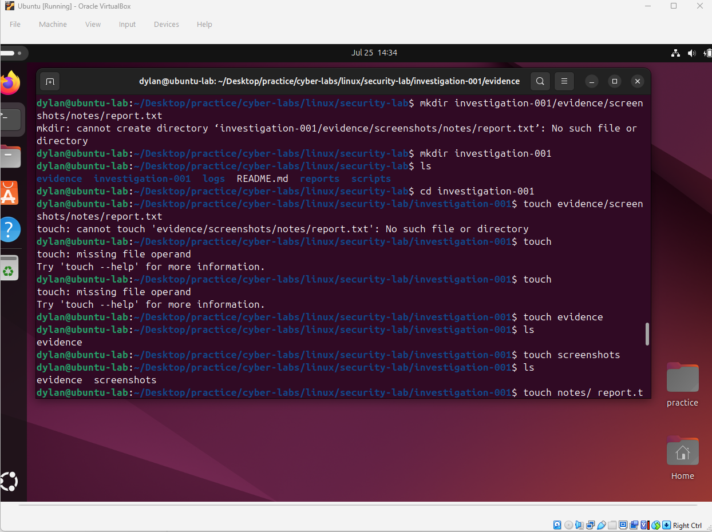
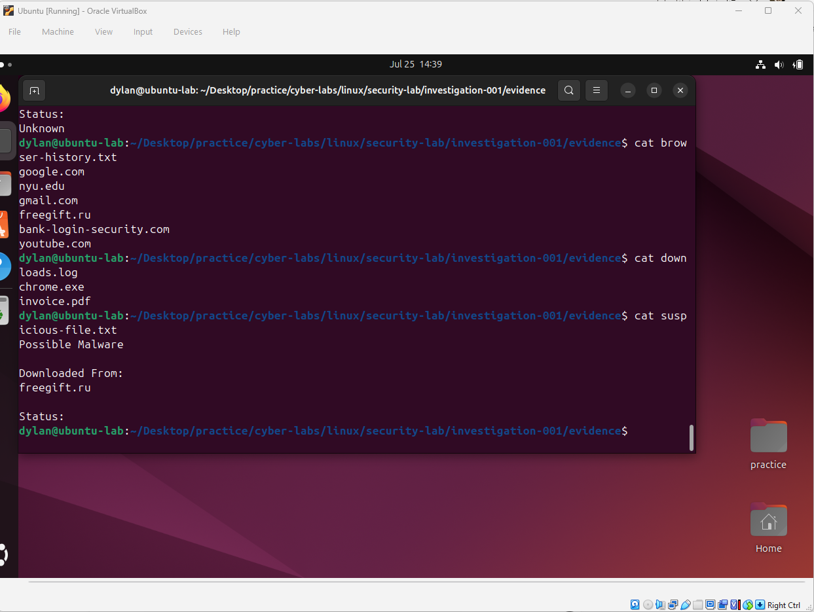

#  Case 001: Incident Investigation

## Case Objective

Create and organize a simulated incident investigation using Ubuntu and the Linux command line.

## Incident Summary

A user reported downloading a suspicious file and experiencing unusual system behavior. The task was to organize the available evidence, inspect the collected artifacts, and identify the most suspicious activity.

## Evidence Structure

```text
investigation-001/
├── evidence/
│   ├── browser-history.txt
│   ├── downloads.log
│   └── suspicious-file.txt
├── notes/
├── screenshots/
└── report.txt
```

## Evidence Reviewed

### Browser History

- `google.com`
- `nyu.edu`
- `gmail.com`
- `freegift.ru`
- `bank-login-security.com`
- `youtube.com`

### Downloads

- `chrome.exe`
- `invoice.pdf`
- `free_game.exe`
- `holiday_photo.jpg`

### Suspicious File

```text
Possible Malware

Downloaded From:
freegift.ru

Status:
Unknown
```

## Investigation Findings

The user visited `freegift.ru`, and the most suspicious downloaded file was `free_game.exe`. The suspicious-file record referenced the same website, suggesting a possible malware download.

## What I Learned

- Files and directories serve different purposes in Linux.
- `cd` is used to enter directories, while files are opened or read using tools such as `nano` and `cat`.
- Relative and absolute paths allow different ways to navigate the filesystem.
- Linux commands become easier to remember when they are used to complete a practical task.
- Errors can help identify whether a command expects a file, directory, or additional argument.

## Commands Practiced

- `pwd`
- `ls`
- `cd`
- `cd ..`
- `mkdir`
- `touch`
- `nano`
- `cat`
- `rm`

## Screenshots

### Building the Investigation Workspace



### Reviewing the Evidence



## Reflection

This was my first Linux security lab. I used the command line to build an investigation workspace, organize and review evidence, and reach a basic incident conclusion. Completing a realistic task made the Linux commands more meaningful than practicing them individually.
